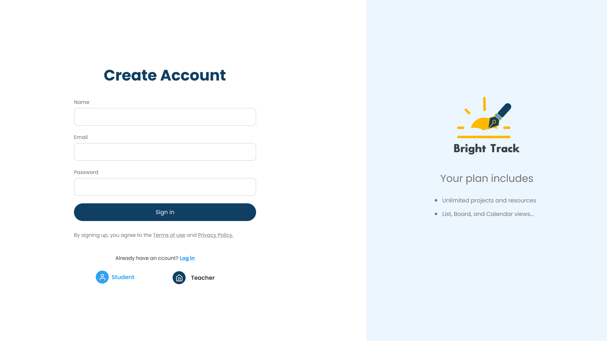
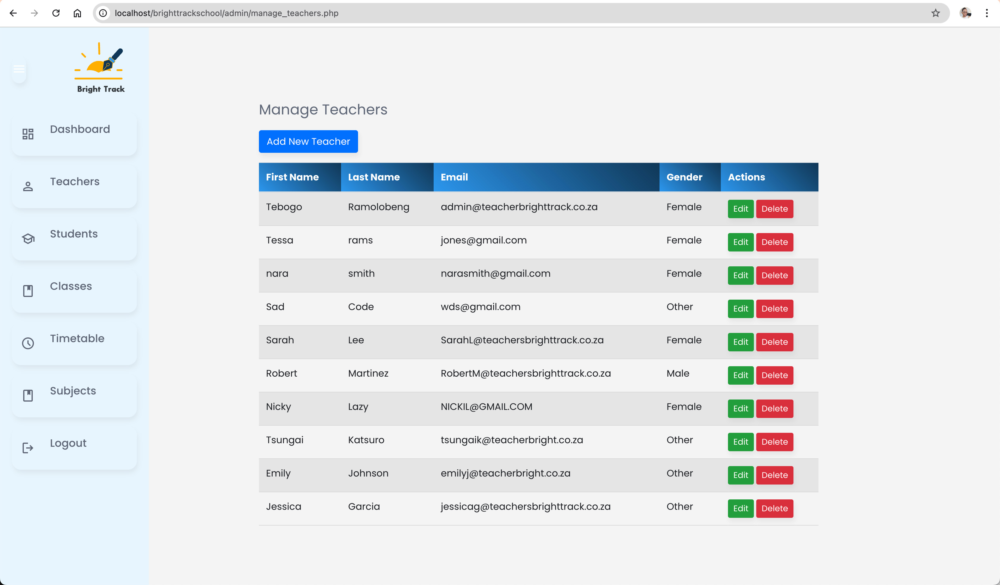
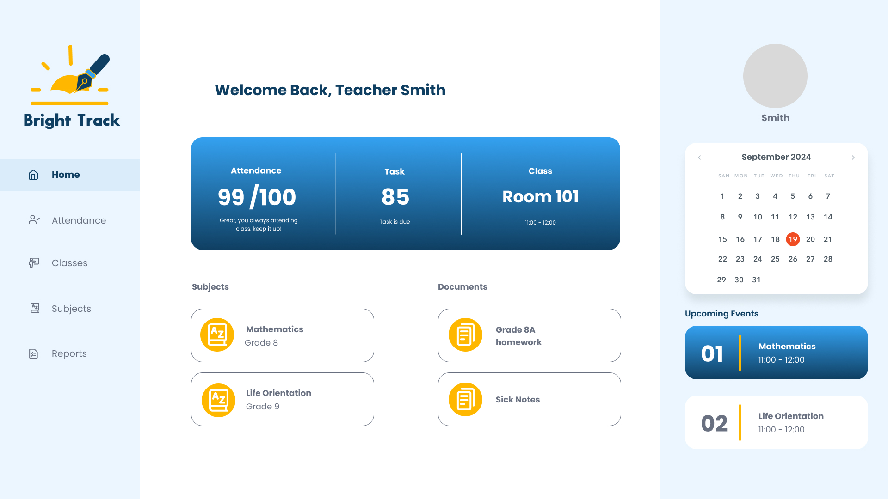
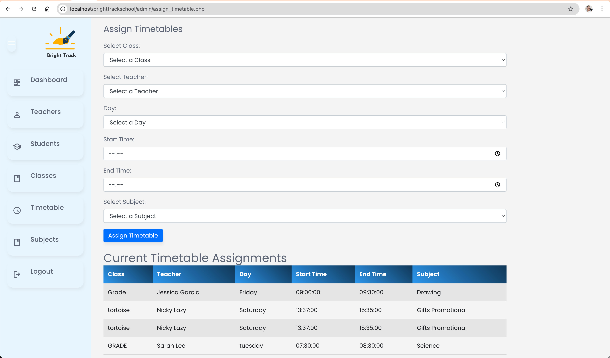

# Bright Track School App

## Overview

The Bright Track School App is an educational platform designed to streamline the interaction between students, teachers, and administrative staff. It facilitates the management of student records, class schedules, teacher assignments, and more, ensuring an effective and organized educational environment.

## Table of Contents
- [Mockups](#mockups)
- [Features](#features)
- [Tech stack](#tech-stack)
- [Installation](#installation)
- [Usage](#usage)
- [API Endpoints](#api-endpoints)
- [Contributors](#contributors)
- [Contributing](#contributing)
- [License](#license)

## Mockups

### Authentication and Registration


### Manage Teachers


### Teacher's Dashboard


### Assign Timetable


## Features

- User registration and authentication system.
- Management panels for students, teachers, and classes.
- Dynamic timetable scheduling and adjustments.
- Real-time updates on class assignments and schedules.
- Administrative tools for user and system settings management.

## Tech stack
- **Frontend:** HTML, CSS, JavaScript
- **Backend:** PHP, MySQL
- **Framework:** Bootstrap for responsive design
- **Server:** Apache

## Installation

1. **Clone the repository**
   ```bash
   git clone https://github.com/221244-Tebogo/brighttrackschool.git
   cd brighttrackschool
