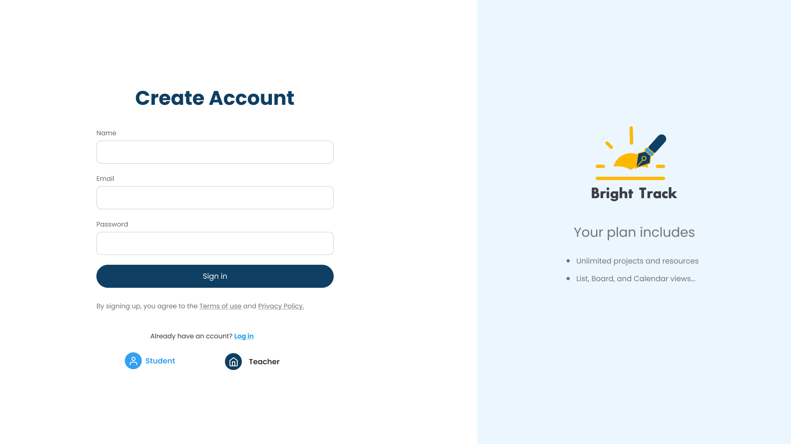

# Bright Track School App

## Overview

The Bright Track School App is an educational platform designed to streamline the interaction between students, teachers, and administrative staff. It facilitates the management of student records, class schedules, teacher assignments, and more, ensuring an effective and organized educational environment.

## Table of Contents

- [Mockups](#mockups)
- [Features](#features)
- [Tech stack](#tech-stack)
- [Installation](#installation)
- [Usage](#usage)
- [API Endpoints](#api-endpoints)
- [Contributors](#contributors)
- [Contributing](#contributing)
- [License](#license)

## Mockups

### Authentication and Registration



### Manage Teachers


### Teacher's Dashboard


### Assign Timetable


## Features

### Admin

- **User Management**: Create, update, and delete user profiles for students and teachers.
- **Class Management**: Add, update, and remove classes, manage class assignments.
- **Timetable Management**: Create and adjust timetables for all classes, manage teacher assignments.
- **Reporting**: Access to comprehensive reports on student performance, teacher activity, and class statistics.

### Teacher

- **Dashboard**: Overview of daily class schedules, upcoming assignments, and alerts.
- **Class Management**: Manage student lists, class schedules, and submit student grades.
- **Resource Sharing**: Upload and manage teaching materials and resources.
- **Communication**: Tools to facilitate direct communication with students and parents.

### Student

- **Class Schedule**: View personal class schedules and upcoming school events.
- **Assignment Submission**: Digital platform for submitting homework and receiving grades.
- **Resource Access**: Download course materials, assignments, and notes.
- **Performance Tracking**: Monitor personal academic performance and receive feedback from teachers.

# <<<<<<< HEAD

> > > > > > > 7848262c60504922a2b8fee3c255490969be5979

## Challenges

During the development of the Bright Track School App, one of the significant challenges I encountered was with the MySQL database management. There was an instance of MySQL running in the background that was not properly shutting down, which caused issues with database access and operations.

After extensive research and troubleshooting, I consulted an IT professional who recommended using the following command to safely restart MySQL without grant tables, which allows for some administrative tasks to be performed without the usual user privilege checks:

<<<<<<< HEAD

````bash
=======
```bash
>>>>>>> 7848262c60504922a2b8fee3c255490969be5979
sudo mysqld_safe --skip-grant-tables

## Demonstration Video

[https://drive.google.com/file/d/1qze3RlPCYia5Pc5dv6nPPAkT4bKSWPZa/view?usp=drive_link](https://drive.google.com/file/d/1qze3RlPCYia5Pc5dv6nPPAkT4bKSWPZa/view?usp=sharing)

## Tech stack

- **Frontend:** HTML, CSS, JavaScript
- **Backend:** PHP, MySQL
- **Framework:** Bootstrap for responsive design
- **Server:** Apache

## Installation

1. **Clone the repository**
   ```bash
   git clone https://github.com/221244-Tebogo/brighttrackschool.git
   cd brighttrackschool
<<<<<<< HEAD
````

=======

```
>>>>>>> 7848262c60504922a2b8fee3c255490969be5979
```
